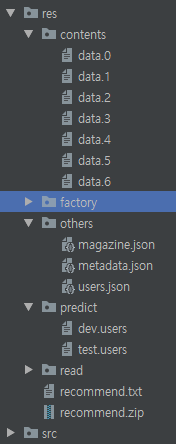
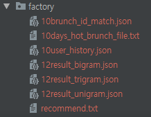

# Kakao_Arena_brunch_recommendation
Kakao_Arena_brunch_recommendation 

## 공개 리더보드 29등 코드

1. 실행전 factory.py를 실행하여 사전데이터를 생성해야 합니다.
2. 머신러닝을 사용하지 않아 별도의 모델 로드는 필요하지 않습니다.

### 머신러닝을 사용하지 않은 n-gram 모델

> 실행전 데이터를 삽입해주세요
> 모든 데이터는 res 디렉토리에 있습니다.
> - res 하위 디렉토리   
>> - 아래 디렉토리에는 kakao에서 제공해주는 데이터를 채웁니다.   
>> read, predict, others(magazine.json, metadata.json, users.json), contents   
>> - factory 디렉토리  
>> facotry.py 실행을 통하여 생성합니다.    
>> days result, ngram Model (Factory.py 실행)   
>> kakao baseline을 실행하여 결과값을 넣어주세요   
>> recommend.txt (kakao baseline 결과값)   
>> ex) @brunch_1 @sw_15 @c1_5 ....   
>> 동일한 결과만 나열되있는 1줄의 결과값  

> 데이터 예시  
  
 
> factory 디렉토리 예시  
  
 

## 모델 제출시 사용한 파라미터
self.unigramscore = 2  
self.bigramscore = 5  
self.trigramscore = 30  
self.keywordscore = 50  
ngram_days = 12  
days = 10  

## 모델 설명
1. 모델 1  
사용자가 본 리스트를 기준으로 n-gram 모델을 만듭니다.  
trigram, bigram, unigram과 사용자의 following 리스트를 이용하여   
사용자가 본 브런치를 이용하여 모델의 각 가중치를줘 합계가 가장 높은순으로 100개를 추천 합니다.  

2. 모델2  
모델 1에서 100개를 다 채우지 못한경우.(readList가 없는경우)  
follwing_list가 있는 기준으로 가장 인기있는 데이터로 채웁니다 (인기있는 데이터 순위는 일자 기준으로)  

3. 모델3  
모델 2에서 100개를 다 채우지 못한경우.  
Kakao Base Line 결과인 100개를 이용하여 채웁니다.  

4. 모델4  
모델 3에서 100개를 다 채우지 못한 경우.  
가장 인기있는 데이터로 채웁니다 (인기있는 데이터 순위는 일자 기준으로)  

## 실행하기

1. 데이터 생성   
factory.py를 실행하여 인덱스 파일을 생성해야 합니다.   
각 변수들에 값을 채운후에 실행해 주세요    
/res/factory 안에 결과 데이터가 생성됩니다.   
제출한 모델의 결과 데이터는 모두 업로드되어 제공됩니다. 
2. 결과파일 생성  
변수에 파라미터를 입력합니다.  
각 변수는 train.py 와 ngram.py 파일에 있습니다  
train.py를 실행하여 결과파일을 생성합니다.  
* 결과 파일은 res디렉토리에 생성되며 압축파일 또한 동시에 생성됩니다.

## 결과데이터가 다르거나 생성이 안되는경우 연락 부탁드립니다.
#### whtngus3232@naver.com

